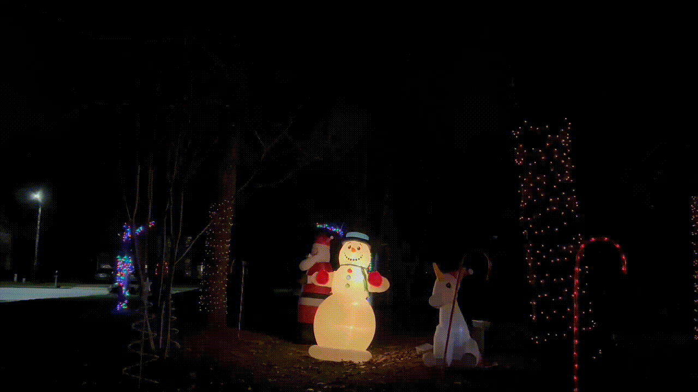

<p align=center>
    
</p>

<p align="center">Control lights and music for Raspberry Pi and more.</p>



## Prerequisites

[Node.js](https://nodejs.org/en/), [Yarn (classic)](https://classic.yarnpkg.com/lang/en/), and [SoX](https://github.com/chirlu/sox).

## Setup

```bash
# Install dependencies
yarn
# Build all packages
yarn build
```

### First time run

```bash
yarn dev
```

1. Open the simulator @ http://localhost:3000/simulator.

2. To play the sample track, click the ▶️ icon in the upper right open playlist drawer and click the track.

3. Watch the demo space do it's thing!
